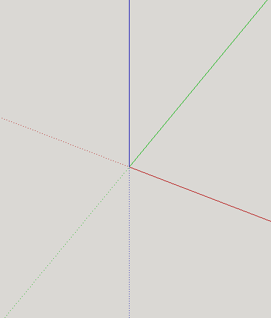
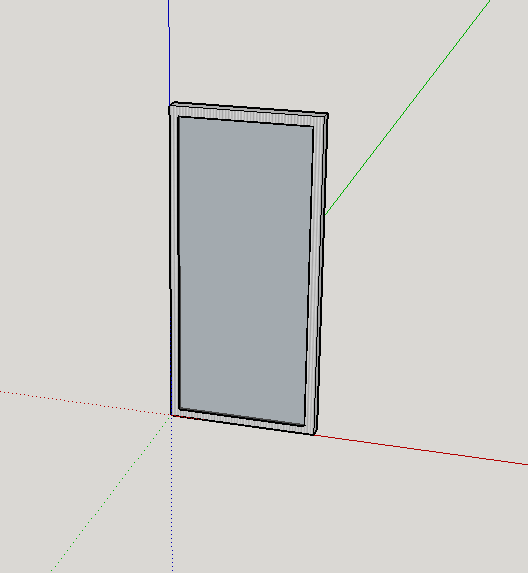
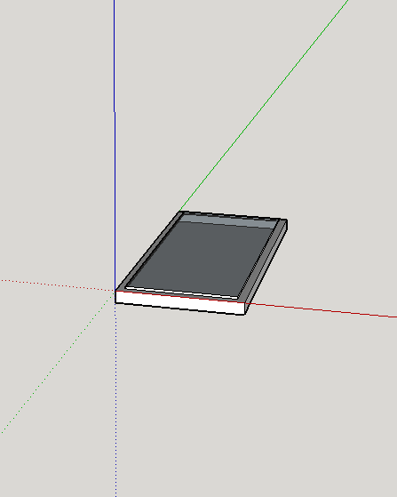
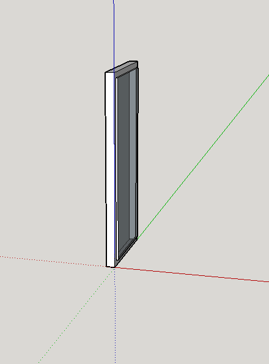
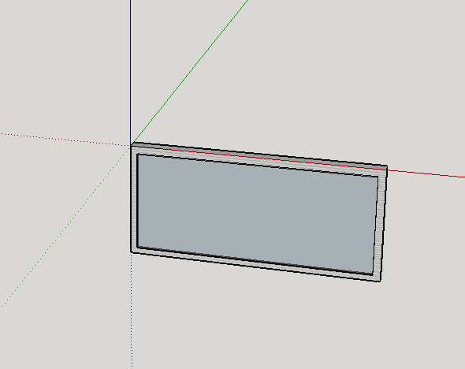

Mobile JSON Wire Protocol Specification
=======================================

### *DRAFT*

Introduction
------------
This specification is designed to extend the [JSON Wire
Protocol](https://code.google.com/p/selenium/wiki/JsonWireProtocol) (JSONWP),
a W3C working draft for web browser automation. The JSONWP has been greatly
successful for that purpose. The need for automation of native and hybrid
mobile applications can be met by the extension of the JSONWP, which already
has a proven basic automation framework (architecture, interaction model,
etc...).

The initial details of this specification were worked out at a series of
meetings held in Mozilla's offices in London in August of 2013. The
participants were:

* David Burns (Mozilla) - [website]() - [twitter](https://twitter.com/automatedtester)
* Dominik Dary (eBay) - [website]() - [twitter](https://twitter.com/dominikdary)
* Jonathan Lipps (Sauce Labs) - [website](http://jonathanlipps.com) - [twitter](http://twitter.com/jlipps)
* Jason ? (Facebook) - [website]() - [twitter]()
* François Reynaud (eBay) - [website]() - [twitter]()
* Simon Stewart (Facebook) - [website]() - [twitter](https://twitter.com/shs96c)
* Santiago Suarez Ordoñez (Sauce Labs) - [website]() - [twitter]()

Sessions
--------
Sessions work just like WebDriver: you POST to /session and receive a sessionid
as a response if the server can give you one, at which point you can send
further automation commands. If the server can't start a session, for example
if another session is running and only one session can be handled at a time,
the server must return the appropriate 500 response. Sessions are ended with
a DELETE to /session/:id as per the original WebDriver spec.

The server may but is not required to launch the AUT or a device/simulator in
the process of creating a session. It may but is not required to perform some
kind of cleaning or resetting of the AUT in order to provide a clean test
environment. It may but is not required to stop the running AUT at the session
end. It may but is not required to remove the AUT from the device or otherwise
reset the device state after the session is complete. In general, it is the
responsibility of the user to manage the test environment; it is not a part of
this specification. But a server conforming to this specification may by other
means provide that functionality as a convenience.

Desired Capabilities
--------------------

New desired capability keys:

* `automationName`: specific automation tool, e.g., `appium`, `ios-driver`, `selendroid`
* `platformName`: platform to automate, e.g., `Android`, `iOS`
* `platformVersion`: platform version e.g., `4.3` (for Android) or `6.1` (for iOS)
* `deviceName`: specific device names including version information, e.g., `Nexus 4`, `iPhone 4S`, `iPhone Simulator`, `iPad Mini`
* `app` (optional): path or uri to AUT
* `browserName` (optional): web browser to automate as a webdriver session, e.g., `Safari`, `Chrome`

Locator Strategies
------------------
The following locator strategies must be supported for non-HTML-based platforms:

* `class name`: a string representing the UI element type for a given platform, e.g., `UIAPickerWheel` for iOS or `android.widget.Button` for Android
    * These should exactly match the class names given by the underlying automation frameworks
* `accessibility id`: a string representing the accessibility id or label attached to a given element, e.g., for iOS the accessibility identifier and for Android the content-description
* `xpath`: a valid xpath string applied to the XML document that would be retrieved using the page source command

The following locator strategies may be supported, depending on the automation
platform:

* `id`: a string corresponding to a resource ID
* `-android uiautomator`: a string corresponding to a recursive element search using the UiAutomator library (Android only)
    * TODO: specify this
* `-ios uiautomation`: a string corresponding to a recursive element search using the UIAutomation library (iOS-only)
* TODO: figure out whether server should report support of these strategies

If automating a mobile browser in WebDriver mode, or a platform that uses HTML
as its element hierarchy, the usual array of WebDriver commands must be
supported instead, with their usual semantics.

Page Source
-----------
All platforms must respond to the `GET source` command with an XML (or HTML in
the case of HTML-based platforms) document representing the UI hierarchy. The
precise structure of the document may differ from platform to platform. Schemas
that must be followed for iOS and Android automation are as follows:

TODO: get together schemas for UIAutomation (iOS), Instruments (Android), and
UiAutomator (Android).

The elements in these documents may be augmented with such attributes as, for
example, ids, in order to support internal behaviors.

Touch Gestures
--------------
All platforms must adopt the Multi-Action API pioneered by Mozilla. In some
cases it will not be possible to support the full range of gestures potentially
described by this API on a given platform. In this case, the platform should
respond with a 500 when it cannot faithfully render the requested gesture.

TODO: show what the gestures API actually looks like in terms of server
endpoints that must be supported.

Device Modes
------------
Devices have various states of network connectivity. In order to control
those states we have the following endpoints:

* GET /session/:sessionid/network_connection
    * returns ConnectionType
* POST /session/:sessionid/network_connection
    * accepts a ConnectionType
    * returns ConnectionType

Setting the network connection in the POST returns the ConnectionType because
the device might not be capable of the network connection type requested.

The remote end MUST reply with the capability "networkConnectionEnabled"

### ConnectionType

Is a bit mask that should be translated to an integer value when serialized.

|Value (Alias)      | Data | Wifi | Airplane Mode|
|-------------------|------|------|--------------|
|1 (Airplane Mode)  | 0    | 0    | 1            |
|6 (All network on) | 1    | 1    | 0|
|4 (Data only)      | 1    | 0    | 0|
|2 (Wifi only)      | 0    | 1    | 0|
|0 (None)           | 0    | 0    | 0|

Example payload for setting "Airplane Mode":

    { "name": "network_connection", "parameters": { "type": 1 } }

Data is the upper bits since in the future we may want to support setting
certain types of Data the device is capable of. For example 3G, 4G, LTE.

Device Orientation
------------------

The [JSON Wire Protocol](https://github.com/SeleniumHQ/selenium/wiki/JsonWireProtocol#sessionsessionidorientation)
already supports a very basic concept of
orientation, involving two orientation options: portrait and landscape.
Ultimately this will be subsumed under Device Rotation (see below), but for now
we continue to support these endopints for mobile devices.

* GET /session/:sessionid/orientation
    * returns ScreenOrientation
* POST /session/:sessionid/orientation
    * accepts a ScreenOrientation

### ScreenOrientation

A `ScreenOrientation` can be one of two strings:

* `LANDSCAPE`
* `PORTRAIT`

Device Rotation
---------------

Mobile devices can theoretically be used in any spatial orientation. Thus the
concept of 'orientation' is actually much more general. We will call this
concept of arbitrary spatial orientation 'rotation'. Currently, mobile OS
automation technologies do not expose hooks for arbitrary rotation, but allow
simply for a small set of 'orientations', like landscape or portrait (largely
because these are the main categories used by apps themselves). We described
some simple 'orientation' options above. Here we describe the spec for
rotation, which can be used when automation tool vendors release support for
more than 'landscape' and 'portrait' orientations.  Apple, for example, already
has more options (such as "portrait + faceup").

We can define any rotation with a combination of 3 angles: rotations around the
X, Y, and Z axes in 3d space. The X axis is horizontal (width), Y is vertical
(height), and Z is extensive (depth).

In the following image, the X axis is red, Y is blue, and Z is green:

We arbitrarily stipulate that the "neutral" position for a device (i.e., its
position when the X, Y and Z angles are 0, 0, and 0) is as follows:

* The device screen is facing us, parallel to the value 0 on the Z axis (i.e.,
  it extends into the positive Z space, not the negative (see below))
* The bottom edge of the device lies on the X axis The left edge of the device
  lies on the Y axis

In the following image, the device is in this "neutral" position:

A device does not necessarily start out in any given automation session in
"neutral" rotation; we simply define this concept in order to have a visual
idea of what it means for a device to be at 0 degrees for all three axes. The
automation server, when requested, should always return the actual rotation.

In terms of polarity, we stipulate that the X axis goes from negative to
positive, left to right. The Y axis goes from negative to positive, bottom to
top. And the Z axis goes from negative to positive, front to back. In the image
above, for example, the dotted axis segments are on the negative scale, and the
solid axis segments are on the positive scale.

Now, assuming the bottom, left, front edge of the device always remains at the
origin point (i.e., the point x=0, y=0, z=0), we can define any rotation. The
"neutral" rotation described above would be equivalent to a normal "portrait"
orientation, the device being held straight out in front of the user. The
rotation `(x=90deg, y=0deg, z=0deg)` signifies a similar portrait orientation,
but "face up" on a table, for example, as in the following image:

And `(x=0deg, y=90deg, z=0deg)` would be:

Finally, `(x=0deg, y=0deg, z=90deg)` would be:

We can now define the necessary endpoints:

* GET /session/:sessionid/rotation
    * returns DeviceRotation
* POST /session/:sessionid/rotation
    * accepts a DeviceRotation

The remote end MUST reply with the capability "deviceRotation" in order
to use these methods.

### DeviceRotation

`DeviceRotation` is an object with 3 keys, `x`, `y`, and `z`. Each of these
represents an angle in degrees (on the real number scale `0 <= deg < 360`).
This is how rotation works for each axis:

* X axis: angles increasing towards the positive Z space
* Y axis: angles increasing towards the positive Z space
* Z axis: angles increasing towards the negative Y space

Example payloads for setting various common rotations:

* Standard portrait
    * `{"x": 0, "y": 0, "z": 0}`
* Portrait face-up
    * `{"x": 90, "y": 0, "z": 0}`
* Portrait face-down
    * Bottom of device towards user: `{"x": 90, "y": 0, "z": 180}`
    * Top of device towards user: `{"x": 270, "y": 0, "z": 0}`
* Portrait, slight away-tilt
    * `{"x": 15, "y": 0, "z": 0}`
* Landscape right
    * `{"x": 0, "y": 0, "z": 90}`
* Landscape left
    * `{"x": 0, "y": 0, "z": 270}`

### Errors

If the `DeviceRotation` object sent in by the client does not conform to the
specification (e.g., if values are non-numeric or out of the allowed range), or
if the server cannot perform the requested specific rotation (say because it is
limited to a certain subset of rotations that does not include the requested
orientation), it MUST respond with an `Unable to Rotate Device` error.

Other Device Features
---------------------
Mobile devices have a variety of sensors and input methods. These are automated
as follows:

* The virtual keyboard: use sendKeys
* acceleromator: TODO @mdas is working on this
* geolocation: use regular webdriver endpoints
* network speed: not in spec, perhaps exposed via executeScript

Battery
-------
Device battery changes might trigger events on users applications, controlling this will help monitor and verify how apps responds to these factors.

The battery state should have two options: ON, OFF depending if the power ac state it's charging or not.

* GET /session/:sessionId/device/battery_state
  * returns BatteryState

* POST /session/:sessionId/device/battery_state
  * accepts BatteryState

A `BatteryState` can be one of two strings:
 * ON
 * OFF

In some cases, apps might respond different on low battery level so the idea is to provide a method to set specific battery percent level for the devices.

* GET /session/:sessionId/device/battery_level
  * returns Integer between [0..100]

* POST /session/:sessionId/device/battery_level
  * accepts Integer between [0..100]

External communication factors
------------------------------
Receiving messages or phone calls it's usual on mobile devices, having the possibility to mock this events would improve the application reaction on this external factors.

### Phone calls(GSM)
The idea is to be able to mock phone calls entering the device and handle the actions that triggers; you may want to accept it, cancel or put it on hold.

* POST /session/:sessionId/device/gsm_call
  * accepts { phoneNumber: PhoneNumber, action: GsmAction }

Where `PhoneNumber` should be a valid phone number and
`GsmAction`'s would be String constants:

* CALL
* ACCEPT
* CANCEL
* HOLD

The `CALL` action should trigger the mocked call to the device from the `PhoneNumber` provided, then another action should take place in order to complete the flow as in real life.

At a certain moment *GSM* service can be altered due to travels, network going down and other factors, so we could add:

* POST /session/:sessionId/device/gsm_state
  * accepts GsmState

to change it using Strings constant to set the `GsmState`:
* HOME
* UNREGISTERED
* SEARCHING
* ROAMING

### SMS
During this days a lot of apps depend on receiving sms, even if they are not a messaging platform, apps may want to check sms to validate accounts, receive promotion codes, etc. We could add

* POST /session/:sessionId/device/sms
  * accepts { phoneNumber: PhoneNumber, message: Message }

been `Message` a valid String text.

WebViews and Other Contexts
---------------------------
One common feature of mobile platforms is the ability to embed a chromeless
webbrowser inside of a 'native' application. These are called 'webviews', and,
if possible, a server for a given platform should implement support for
automating the webview using the full, regular, WebDriver API.

This creates a situation where there are two potential contexts for automation
in a given AUT: the native layer and the webview layer. If providing webview
support, the server must have the following endpoints:

* GET /session/:sessionid/contexts
    * returns an array of strings representing available contexts, e.g.
      'WEBVIEW', or 'NATIVE'
* GET /session/:sessionid/context
    * returns one of:
    * a string representing the current context
    * `null`, representing "no context"
* POST /session/:sessionid/context
    * accepts one of:
    * a string representing an available context

The first endpoint must return a possibly-empty array of strings. Each string
must be the arbitrary name of an available context, e.g., one of possibly
multiple webviews.  The second must interpret the body of the request as the
name of an available context. If that context is not found, a NoSuchContext
error (code 35) must be returned.  If the context is available, the server must
switch automation to that context, such that all subsequent commands are taken
to apply to that context. If the body of the POST is `null`, the server must
return to the original context.

If a server receives a request at an endpoint which is valid in some context
but not the currently active context (for example if a user calls
`driver.get()` in a native context instead of a webview context), the server
must respond with an InvalidContextException (code 36).

Waiting for Conditions
----------------------
The server must respond to the management commands for implicit wait timeouts,
such that when a user sets an implicit wait timeout and tries to find an
element(s), the server keeps trying to find the element(s) until that timeout
expires, rather than responding with the first failure to find the element(s).

TODO: figure out what the serversidewait implementation will be and talk about
it.
